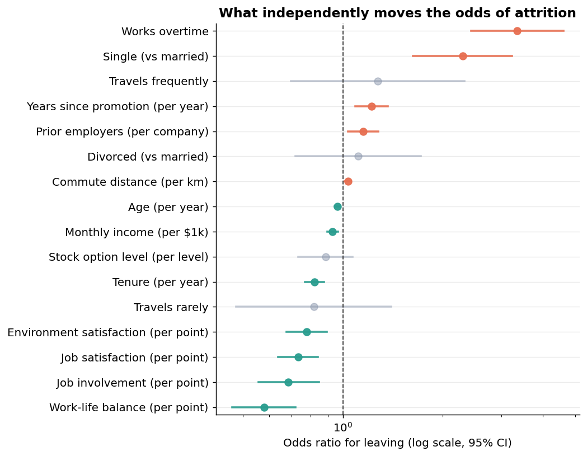

# Workforce & People Analytics: an end-to-end attrition and KPI study

An end-to-end people analytics project that turns raw HR records into the standard
measures a workforce team reports on, then runs a proper statistical study of **what
drives people to leave**, and ships the result three ways: a SQL warehouse, a Power
BI model, and a Databricks lakehouse.

> A worked example of the people analytics workflow: model the data into a star
> schema, compute Turnover, Absenteeism, and Quality of Hire, explain attrition with
> a logistic regression framed in I-O Psychology, and communicate it in a dashboard
> and a research write-up.

---

## Headline measures (IBM HR dataset, trailing 12 months)

| Measure | Value |
|---|---|
| Annualised turnover | **17.5%** |
| Absenteeism rate | **1.3%** of scheduled hours (3.2 days per employee) |
| Quality of Hire index | **74.8 / 100** |
| Average time to fill | **45 days** |



The strongest drivers of leaving are **frequent business travel and overtime** (both
more than 5x the odds), ahead of being single and of promotion stagnation, while job
involvement, the other job attitudes, and tenure are the strongest protective factors. Full write-up in
**[reports/executive_summary.md](reports/executive_summary.md)** and the narrative
version in **[reports/blog_post.md](reports/blog_post.md)**.

---

## Why this project

People analytics teams answer two kinds of question: *what are our workforce vital
signs* and *why are they moving*. This project does both. It builds the measures an
HCM team publishes (turnover, absenteeism, quality of hire) and then goes past the
dashboard to a defensible explanation of attrition, the difference between reporting
a number and being able to act on it.

It deliberately sits on the analyst side of the analyst and data scientist line:
the goal is to explain what the data says about the past, with significance tests and
effect sizes, rather than to score individuals for the future.

## Dataset

**Core:** the [IBM HR Analytics Employee Attrition & Performance dataset](https://www.kaggle.com/datasets/pavansubhasht/ibm-hr-analytics-attrition-dataset)
(1,470 employees), the standard teaching dataset for HR analytics. It carries
demographics, job context, compensation, performance, and the Likert style I-O
Psychology constructs (job satisfaction, environment satisfaction, work-life balance,
job involvement) that anchor the attrition study.

**Simulated supporting facts:** the base file has no dates, absence, or hiring
records, so the pipeline generates two reproducible, seeded fact tables keyed to each
employee: absence spells (for Absenteeism Rate) and recruitment records (for Quality
of Hire and Time to Fill). This keeps every measure on one employee population so the
joins are real. The generation is in `src/make_sample_data.py` and is documented, not
hidden.

The repository ships **no data files**. From a clean checkout the pipeline writes a
faithful synthetic stand-in so it runs out of the box. To reproduce the published
figures on the real data, download the IBM CSV (free Kaggle account) into `data/raw/`
as `WA_Fn-UseC_-HR-Employee-Attrition.csv` and rerun; the absence and recruitment
facts then key to the real employees automatically.

> The IBM dataset is a public, de-identified, fictional dataset created for analytics
> education. It is used here strictly for that purpose.

## Architecture

A medallion pipeline, so the local build and the Databricks build are the same shape.

```
data/raw  (IBM employees CSV  +  simulated absence  +  simulated recruitment)
   │   src/make_sample_data.py        generate the sample, or drop in the real IBM CSV
   ▼
src/build_warehouse.py
   │      bronze (raw)  ──►  silver star schema      sql/01_star_schema.sql
   ▼
src/kpis.py
   │      silver  ──►  gold marts                    sql/02_kpi_queries.sql
   ▼
   ├─►  src/attrition_study.py   logistic regression + chi square + t tests  ──►  reports/
   ├─►  src/visuals.py           figures                                     ──►  reports/figures/
   └─►  src/export_powerbi.py    star schema + marts                         ──►  dashboard/

databricks/   the same bronze, silver, gold on PySpark + Delta + Unity Catalog,
              queried live by Power BI through Partner Connect
```

The silver layer is a Kimball star schema: a wide `dim_employee` with the I-O
constructs, conformed `dim_department`, `dim_job_role`, and a monthly `dim_date`,
and three fact tables (`fact_employment`, `fact_absence`, `fact_recruitment`) that
share those dimensions. That shared, conformed design is what lets one model slice
turnover, absenteeism, and quality of hire by the same department, role, and calendar.

## The standard measures

| Measure | Definition used here |
|---|---|
| **Turnover** | Annualised separations divided by average headcount (active heads plus half the leavers present part of the year). The simpler attrition rate, separations over population, is reported alongside it. |
| **Absenteeism rate** | Absence hours over scheduled hours across the trailing year, with each employee's scheduled hours prorated for the part of the window they were employed. |
| **Quality of Hire** | An equally weighted 0 to 100 composite of four components: performance, first year retention, ramp-up speed, and hiring manager satisfaction, reported by recruiting source. |
| **Time to Fill** | Days from requisition open to hire, by source channel. |

A clean, recognisable finding falls out of Quality of Hire: **employee referrals and
internal transfers produce the best hires, fastest, and cheapest**, while agency hires
rank lowest on quality and highest on time and cost.

## The research study

`src/attrition_study.py` estimates a multivariable **logistic regression** of leaving
on the full set of drivers and reports each as an odds ratio with a 95 percent
confidence interval. Every bivariate relationship is also tested on its own with a
chi square test (categorical, Cramer V effect size) or a Welch t test (continuous,
Cohen d effect size), so each claim comes with both significance and magnitude. The
model reaches a McFadden pseudo R squared of about 0.27.

| Raises the odds of leaving | OR | Lowers the odds of leaving | OR |
|---|---|---|---|
| Travels frequently | 5.44 | Job involvement (per point) | 0.56 |
| Works overtime | 5.40 | Job satisfaction (per point) | 0.70 |
| Single (vs married) | 2.18 | Work-life balance (per point) | 0.74 |
| Years since promotion (per year) | 1.21 | Tenure (per year) | 0.89 |

Read through an I-O Psychology lens, the pattern matches established withdrawal
models: strain and work-life conflict (overtime, travel) push people out, job
attitudes and embeddedness (satisfaction, involvement, tenure, equity) hold them in.

## Power BI

`src/export_powerbi.py` writes the gold marts and the full star schema to `dashboard/`,
ready to import into Power BI Desktop. The model is built on `gold_employee_analysis`
with `dim_date` and `fact_absence`, and the measures (turnover, absenteeism, Quality of
Hire, time to fill, and a point-in-time headcount) are defined in
**[powerbi/dax_measures.md](powerbi/dax_measures.md)**, laid out across an executive
overview, an attrition deep dive, an absence view, and a talent acquisition page.

## Databricks

`databricks/` lifts the same medallion architecture onto a lakehouse with PySpark and
Delta: `01_bronze_ingest.py` and `02_silver_model.py` rebuild the bronze and silver
layers in Spark, and `03_gold_kpis.sql` computes the gold measures in Databricks SQL,
all governed by Unity Catalog and runnable on the free Databricks Free Edition, with
Power BI connecting live to the gold layer through Partner Connect.

## Reproduce

```powershell
# 1. environment (Python 3.13)
py -3.13 -m venv .venv ; .venv\Scripts\python -m pip install -r requirements.txt

# 2. run the pipeline
.venv\Scripts\python src\make_sample_data.py     # or drop the real IBM CSV in data/raw first
.venv\Scripts\python src\build_warehouse.py
.venv\Scripts\python src\kpis.py
.venv\Scripts\python src\attrition_study.py
.venv\Scripts\python src\visuals.py
.venv\Scripts\python src\export_powerbi.py
```

## Repository layout

```
src/        pipeline (config, sample data, warehouse, KPIs, study, visuals, export)
sql/        01_star_schema.sql (dimensional model), 02_kpi_queries.sql (gold measures)
databricks/ PySpark + Delta + Databricks SQL notebooks
powerbi/    DAX measures for the Power BI dashboard
reports/    executive_summary.md, blog_post.md, metrics.json, figures/
dashboard/  Power BI extracts (gold marts + star schema), generated
data/        raw and processed, generated and not committed
```

## Tech stack

Python (pandas, statsmodels, scikit-learn, scipy, matplotlib) · SQL (SQLite locally,
Databricks SQL on the lakehouse) · PySpark and Delta Lake · Power BI.

## Roadmap

- [ ] Publish the dashboard to the Power BI service with scheduled refresh
- [ ] Survival analysis of time to attrition, not just the binary outcome
- [ ] Add fairness and adverse-impact checks across protected groups
- [ ] Schedule the Databricks pipeline as a Workflow with data quality expectations
