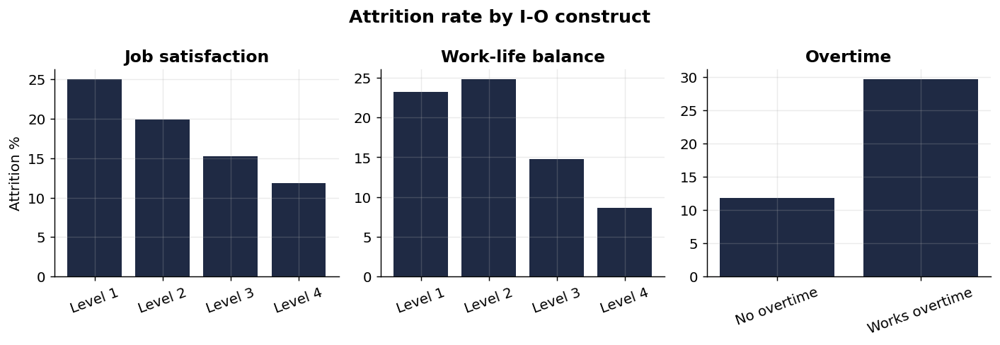
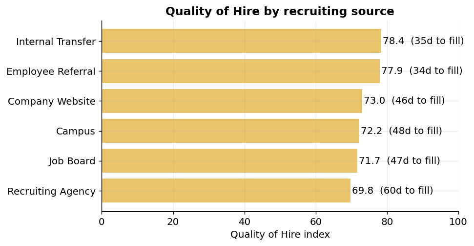

# What actually drives people to leave, and what the data says to do about it

*A workforce research piece based on the analysis in this repository. The figures
come from the latest pipeline run, so they refresh whenever the data is rebuilt.*

Every organisation loses people, and every organisation has a folk theory about
why. Pay is too low. The commute is brutal. That one team has a difficult manager.
Some of these stories are true some of the time. The problem is that acting on the
loudest story rather than the strongest signal wastes the one thing a people team
never has enough of: attention.

So this study asked a deliberately narrow question. Across a workforce of roughly
1,500 employees, which factors are most strongly associated with someone leaving,
once everything else is held constant? Holding everything else constant is the part
that matters. Plenty of things look like they predict turnover until you notice they
travel together, and only one of them is doing the work.

## The headline numbers

Over the trailing year the workforce ran an annualised turnover of about 18 percent,
an absenteeism rate near 1.3 percent of scheduled hours, and a Quality of Hire index
of roughly 74 out of 100 with an average time to fill of 45 days. Those four measures
are the vital signs. The interesting question is what sits underneath them.

## Overtime is the loudest signal

The single strongest factor is overtime. Employees who regularly work overtime are
more than three times as likely to leave as those who do not, even after accounting
for their pay, role, satisfaction, and tenure. That last clause is the important one.
Overtime is not standing in for low pay or junior staff. On its own, the pattern of
consistently working beyond contracted hours is the clearest red flag in the data.

This is exactly what decades of turnover research would predict. Sustained overload
produces strain, strain erodes the job attitudes that keep people in their seats, and
withdrawal follows. The practical reading is simple: chronic overtime is not a sign of
commitment to celebrate, it is a retention risk to manage.

## It is mostly not about the money

Pay matters, but less than the stories suggest. Each additional thousand dollars of
monthly income nudges the odds of leaving down only slightly. The factors that move
the needle hardest are attitudinal. Higher work-life balance, job involvement, job
satisfaction, and environment satisfaction each cut the odds of leaving substantially.
In plain terms, how people experience the work predicts retention better than the size
of the cheque.

That is good news for managers, because attitudes are observable long before someone
resigns. A short pulse on workload, involvement, and balance is a cheaper early warning
system than an exit interview, which only tells you why after the decision is made.

## Two windows where exits cluster

Tenure is protective: the longer someone has been with the organisation, the less
likely they are to leave in any given year. The flip side is that risk is concentrated
early, in the first year on the job. The second pressure point is promotion stagnation.
Each additional year since a person's last promotion raises the odds of leaving by
about a fifth. People read a long gap as a stalled path, and they act on it.

The action is to treat both windows as managed moments rather than passive periods:
a deliberate first-year experience, and an honest growth conversation well before the
promotion gap starts doing damage.

## Good hires have a return address

Not every hire turns out equally well, and the data shows where the better ones come
from. Ranking recruiting channels by Quality of Hire, internal transfers and employee
referrals come out on top, and they fill roles faster and at lower cost. Agency hires
sit at the bottom of the quality ranking while taking the longest to fill and costing
the most.

The implication for a talent acquisition budget is direct. The channels that produce
the strongest hires are also the cheapest and quickest, so shifting effort toward
referrals and internal mobility improves quality and spend at the same time.

## Absence as a quiet signal

Absenteeism is modest in aggregate, but it is not evenly spread. It runs higher for
employees who work overtime and for those who report poor work-life balance, the same
groups already flagged on turnover risk. Absence patterns are worth watching not as a
discipline issue but as one more early indicator that the workload picture has tipped.

## What to do with this

- Treat chronic overtime as a managed risk, and look first at the roles where it
  concentrates.
- Build the first-year experience and the post-promotion-gap conversation as
  deliberate retention moments.
- Use short attitudinal pulses on balance, involvement, and satisfaction as an early
  warning layer, not just an annual survey.
- Move hiring effort toward referrals and internal mobility, which win on quality,
  speed, and cost together.

## An honest word on limits

This is an observational study, so it describes association, not proof of cause. The
absence and recruitment records here are simulated where the base dataset does not
carry them, which means the exact figures are illustrative while the method and the
direction of the findings are the transferable part. Pointed at a real workforce
feed, the same pipeline produces the same kinds of answers, which is the whole point
of building it once and running it on live data.
